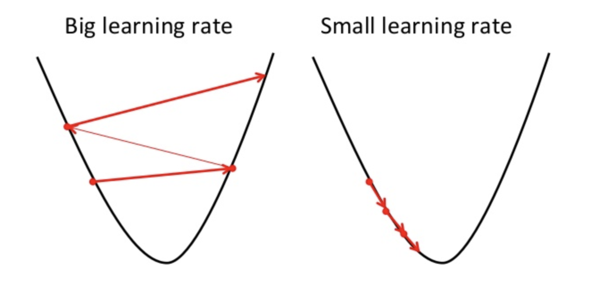
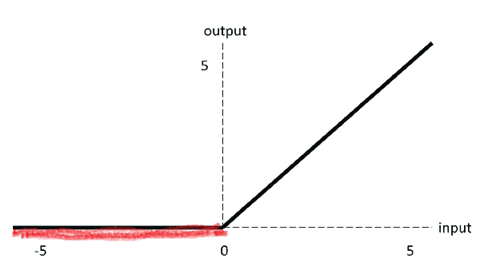
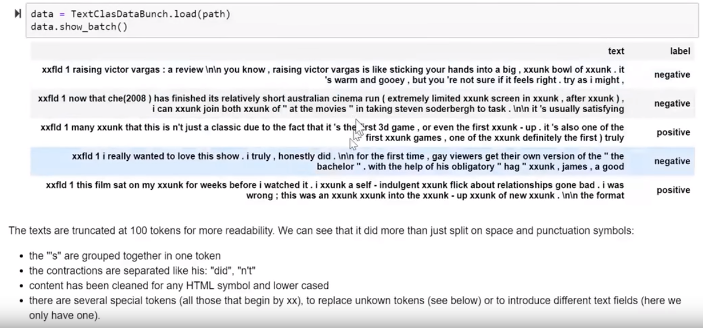

# B_Class

[Tribe of AI - B Class - Deep Learninig](https://github.com/tribeofai/workshops/tree/master/B_Class)


## Sprint 1
### [Kaggle - Deeplearninig]()

**[Intro to DL for Computer Vision](https://www.kaggle.com/dansbecker/intro-to-dl-for-computer-vision)**

* Tensorflow - Dominant AI Engine
* Keras - popular AI api for specifing deep learninig models

**Images**:
- composed of pixels
- Rows and columns, baiscally a Matrix of numbers, where each number represents brightness of that pixel. (Grayscale image) 


- Colour images 3D (Blue, Green Red matrixes), where each pixel stores how Blue, Green or Red it is.

**Convolutions** - is a small tensor which can be applied of a little sections of an image. They are also called filters.


You don't directly choose the numbers to go into your convolutions for deep learning... instead the deep learning technique determines what convolutions will be useful from the data (as part of model-training)

**[Building Models From Convolutions](https://www.kaggle.com/dansbecker/building-models-from-convolutions)**


Such networks in images can help object detection. **IMAGENET** is a popular dataset with a lot of labeled images used to create models able to recognize new same labeled images at 80% accuracy. We can use Imagenet dataset to train new models, but we can also use already trained models for our predictions.

### FAST.AI

Practical Deep Learning for Coders, v3
**[Lesson 1: Image classification](https://course.fast.ai/videos/?lesson=1)**

- Pytorch popular DL library, fastai uses it.

- Fastai is library that supports: Vision, NLP(Text), tabular data and collaborative filtering.

Fine-grained classification - in basically where you have to distinguish between similar categories. (Like differentianting breed of dogs and cats, to which they belong)

For comupter vision we have to make **images of the same size and shape**. Mostly making images square. (Common size is 224) - Generaly this size will work most of the time.

**Why do you use normalize images?**
Some channels tend to be very bright, others not etc, it helps DL by making channels mean of 9 and std of 1.

if you data is not normalized, it may be problem for model to learn.

Restnet - (34 or 50) convolutional model which works mostly very well on classification problems. (Restnet is a Pretrained model, based on millions of data trained on imagenet)

Metrics, are just metrics which are printed out. We always print out metrics on validation set.

**Transfer learninig** - taking a model that already knows how to do something pretty well and make it so that it can do your thing really well.

So you take already trained model, fit it with your data and boom. You make a amazing model that took thousands or less of the time/data of regular model traininig.

in practice you use .fit_one_cycle() instead of .fit() (In 2018 best mothod)

```.fit_one_cycle(4)``` 4 - indicates that it will run 4 cycles.


**Power of Deep learninig**
Top researchers of Oxford in 2012 built best experimental models that predicted cat/dog breed with around 60% accuracy.

Today, with few lines of DL code, using transfer learninig, and 1-2 minutes of traininig, we can achieve 94% of accuracy.

**Keras** is alternative to FASTAI, a good library too.

**Loss function** - tells how good is your prediction. 

.most_confused(min_val=2) - grabs from confussion matrix which were mistaken and brings you back a list, based on your min value. Easier than confusion matrix to distinguish which were wrong.


```.unfreeze()``` - a Thing that says please train the whole model.

**Visualizing and understanding CNN**

* 1st layers. Simply finds gradients of few colours, or some lines, like horizontal vertical etc.


* 2nd layer. Takes the results of those filters and does a second layer of computation. Allows to create, learned to create, recognize corners, or circles or slightly more complex things.


* 3rd layer. You can find combinations of those of previous layers, even more complex structures. From examples parternns, car tyres, or something rounds, texts, people and more.. .


* 4/th layers could identified even more complex structures based on previosu computations. Like dog faces, like legs etc...


and by the time we get to high layers, model is capable of differentiating dog/cat breeds.

**Learning rate** - how quickly am I updating parameters in my model.


**batchsize (bs)**, you can indicate batchsize, to make traininig in batches, this removes error of memory problems.

### Deeplearning.ai

**[Introduction to Deep Learninig](https://www.coursera.org/learn/neural-networks-deep-learning)**


RELU - Rectified linear unit. (Taking a max of zero, thus values become positive?)

Example of simple NN where its gola to predict price based on inputs (Size,zip,bedrooms,etc)


Given enought traininig examples, NN are very good to make functions mapping A to Y.

So far most AI value came from **Supervised Learning.** Examples, below:


* For Home prices (Standard Neural networks)
* For images, CNN (Convolutional Neural Nets would be used)
* For Audio data, RNN (Recurrent Neural nets would be used)


**Unstructured data:** Audio, Images, Text. 
Historically it has been hard for machines to work with these data, but now with DL it got much easier, and thus new applications are available.

Why DL taking off?
* Large amount of Data (Labeled data for SL)
* Better algorithms (NN)
* Better computing

**m denote** - Number of training examples


### [An overview of gradient descent optimization algorithms](https://ruder.io/optimizing-gradient-descent/)

Gradient descent is one of the most popular algorithms to perform optimization and by far the most common way to optimize neural networks

**Gradient descent variants**
There are three variants of gradient descent, which differ in how much data we use to compute the gradient of the objective function. Depending on the amount of data, we make a trade-off between the accuracy of the parameter update and the time it takes to perform an update.

* **Batch gradient descent**
* **Stochastic gradient descent**
* **Mini-batch gradient descent** (Most popular)

## Sprint 2
### [Kaggle - Deeplearninig]()

**[Tensorflow programming](https://www.kaggle.com/dansbecker/tensorflow-programming)**

Basic intro to Tensorflow and quick hands on code to build Dog breed identification system, based on Resnet50.

```
import os
from os.path import join


hot_dog_image_dir = '../input/hot-dog-not-hot-dog/seefood/train/hot_dog'

hot_dog_paths = [join(hot_dog_image_dir,filename) for filename in 
                            ['1000288.jpg',
                             '127117.jpg']]

not_hot_dog_image_dir = '../input/hot-dog-not-hot-dog/seefood/train/not_hot_dog'
not_hot_dog_paths = [join(not_hot_dog_image_dir, filename) for filename in
                            ['823536.jpg',
                             '99890.jpg']]

img_paths = hot_dog_paths + not_hot_dog_paths
```


```
from IPython.display import Image, display
from learntools.deep_learning.decode_predictions import decode_predictions
import numpy as np
from tensorflow.keras.applications.resnet50 import preprocess_input
from tensorflow.keras.applications import ResNet50
from tensorflow.keras.preprocessing.image import load_img, img_to_array


image_size = 224

def read_and_prep_images(img_paths, img_height=image_size, img_width=image_size):
    imgs = [load_img(img_path, target_size=(img_height, img_width)) for img_path in img_paths]
    img_array = np.array([img_to_array(img) for img in imgs])
    output = preprocess_input(img_array)
    return(output)


my_model = ResNet50(weights='../input/resnet50/resnet50_weights_tf_dim_ordering_tf_kernels.h5')
test_data = read_and_prep_images(img_paths)
preds = my_model.predict(test_data)

most_likely_labels = decode_predictions(preds, top=3)
```

Vizualize predictions:
```
for i, img_path in enumerate(img_paths):
    display(Image(img_path))
    print(most_likely_labels[i])
```


### FAST.AI

Practical Deep Learning for Coders, v3
**[Lesson 2: Data cleaning and production; SGD from scratch](https://course.fast.ai/videos/?lesson=2)**

Some interersting examples, where sound is turned into images, and DL is used with some pretrained models (Transfer learninig) to tackle new problems. What solutions could you think of?

**Learninig rate** choosing, based on graph. According to Jeremy best practice is to choose the steep long drop, where it's learninig the most and somewhere in the middle of the drop, use that learninig rate.


Built simple model distinguishing Teddy bear vs Black bear vs Grizly. (2-4% error).

Possiblities to improve model performance:
* Clean data better, get better images

**In production, you are going to use CPU!** Because you need to make only one prediction at a time. 

**Things that can go wrong**
* Most of the time things will train fine with the defaults
* There's not much you really need to tune (despite what you've heard!)
* Most likely are
* Learning rate 
    * Too high
    * Too low (You never want to have traininig loss higher than validation loss, so lr too low or epochs to low)
* Number of epochs
    * too few epochs
    * too many epochs, overfitting (Will learn your teddy bears to well rather than general understanding of teddybears). You will see error rating falling, but then climbing back again.

* Train_loss > valid_loss is totally fine and not an overfiting criterion, as long as error rate is falling down.

When model is making prediction, he makes predictions for all possible classes and their probabilities. And then, it uses Argmax function, returns the index(label) of something which had the highest probability. In our case either 'Teddy bear', Black Bear, or Grizzly bear.


Metrics included in model, are always going to be applied onto **Validation set.**

Most of the time you usually need less data than you think. 


**What do you do when data is unclasified?**

* Try with unbalanced data, usually it works, despite unlabalanced data (Probably it's not like in machine learning)

**When we upload/use restnet model as based, do we load it, store it's size?**

* No, we just storer the algorithm, function, thus we are not storing the restnet model.

### **What is SGD?** 
* Stochastic Gradient Descent

Tensor in DL/ML, means an array.
```
[1,
 2,
 3]

 tensor(3,2) - in pytorch, creates tensor.
```

E.g. image is a 3d tersor (Height x Width x Channels (Red,Green,Blue))

With **Tensors we say ranks. Images is Rank 3 Tensor.**


```a = tensor(-1.,1)``` - Dot after 1. gives python understading that the number is float, rather than integer.

SGD in general, taking guess and trying to make loss better - optimize it. It reduces weights, increases weights, test bigger or smaller slopes and calulates loss.


in python ```a.sub_(lr * a.grad)``` _after a variable means replace a value, ineased of returning a new one.

**Graph illustrates the imprtance of learning rate.** Its important to set one, it's also important to make sure it's not too large, so it doesnt jump too far and mises your optimal point. Hence slightly lower may be a good option. (Too small may cause, slow training)

Ideally you want somthing that is nor too small, nor too big, so it finds best point asap.


**Mini-batches** - when we have a lot of data, like million points, calculating gradient on the whole dataset makes no sense. 

But what makes sense is to use a **Mini-batches**, like 64 images at a time, at random, and calulate loss, and update the weights. and this apporach is called SGD **(Stochastic gradien descent)**

**Learninig rate** - is the thing we multiply gradient by, to decide how much update weights by.

**Epoch** - is one complete run over all our images. (But if we use minibatch, and have 1000 datapoint, use 100 as mini-batch, it would take 10 epochs to go through all points) 

**Too many epochs**, you start going over the same images again, and thus model may remember them and can begin overfitting. Generally you don't want to do too many epochs.

**Mini-bacth** - just random bunch of points you use to update your weights.

**SGD(Stochastic gradient descent)** - just gradient descent using mini-batches.

**Model/Architecture** - Architecture is a mathematical function.

**Parameters** - also known as weights, also know as coeficients, the numbers that you are updating.

**Loss fucntion** - is the thing that tells you how far or close you are to the correct answer.


### Deeplearning.ai

**[Neural Networks Basics](https://www.coursera.org/learn/neural-networks-deep-learning)**

**Binary Classification**
Where you get image and predict 1(cat) vs 0 (non-cat)

Image is repressented as 3D Tensor(3D matrix). Where it has Height, Width, and 3 channels for (Red, Green, Blue) colors.

We then put this into 3D tensor into 1 long array.


Vectorized matrix calculations, using numpy are 300 times faster, than using regular for loop in python. Numpy has many great comuptational stuff that are almost always much faster than loops.


Python boradcasting:

```
#sums columns
cal = A.sum(axis=0) 

#calculates percentage
percent = 100 * A/(cal.reshape(1,4))
```


Another broadcasting example.


When working, must be careful with using 1D array, where ```(5,)```, as it may cause some bugs.


Recommended instead using (5,1) column or (1,5) row vectors instead.


Two common numpy functions used in deep learning are np.shape and np.reshape().

```X.shape``` is used to get the shape (dimension) of a matrix/vector X.

```X.reshape```(...) is used to reshape X into some other dimension.


## Sprint 3
### [Kaggle - Deeplearninig]()

**[Transfer Learninig](https://www.kaggle.com/dansbecker/transfer-learning)**

Transferlearninig, is reusing pretrained models for your new problems. Like using restnet model, pretrained on image net on recignizing various things, to recognize your problem, like teddy bear, or female or male etc.


```
from tensorflow.python.keras.models import Sequential
```
**Sequantial model**, that sequence of layers one after another.

```
#import needed modules

from tensorflow.python.keras.applications import ResNet50
from tensorflow.python.keras.models import Sequential
from tensorflow.python.keras.layers import Dense, Flatten, GlobalAveragePooling2D

#Specifing number of clases we will have, for classification

num_classes = 2

resnet_weights_path = '../input/resnet50/resnet50_weights_tf_dim_ordering_tf_kernels_notop.h5'

#We use sequantial model, things go in a row

my_new_model = Sequential()

#preload restnet, excluding top layer, as we dont need to classify pretrained images, but we will use our layer as top, to classify our problem images

my_new_model.add(ResNet50(include_top=False, pooling='avg', weights=resnet_weights_path))

#we use softmax, to give probabilities to classifications, so that our model picks most probably guess on image

my_new_model.add(Dense(num_classes, activation='softmax'))

# Say not to train first layer (ResNet) model. It is already trained
my_new_model.layers[0].trainable = False

```

### Compile model:

```
my_new_model.compile(optimizer='sgd', loss='categorical_crossentropy', metrics=['accuracy'])
```

### Fit model:

```
#import some models
from tensorflow.python.keras.applications.resnet50 import preprocess_input
from tensorflow.python.keras.preprocessing.image import ImageDataGenerator

#specify images size
image_size = 224

#use TF premade function to indicate where is the data. 

data_generator = ImageDataGenerator(preprocessing_function=preprocess_input)


#train data indication with data_generator. Data is in folder, where there are subfolders for each class.

train_generator = data_generator.flow_from_directory(
        '../input/urban-and-rural-photos/rural_and_urban_photos/train',
        target_size=(image_size, image_size),
        batch_size=24,
        class_mode='categorical')


#Validation data indication with data_generator

validation_generator = data_generator.flow_from_directory(
        '../input/urban-and-rural-photos/rural_and_urban_photos/val',
        target_size=(image_size, image_size),
        class_mode='categorical')

#Fitting model, indicating train, how many steps, validation data and steps for validation. Vualia

my_new_model.fit_generator(
        train_generator,
        steps_per_epoch=3,
        validation_data=validation_generator,
        validation_steps=1)
```
Some exercise examples presaved, and you can already do some projects.

### FAST.AI

Practical Deep Learning for Coders, v3
**[Lesson 3: Data blocks; Multi-label classification; Segmentation](https://course.fast.ai/videos/?lesson=3)**

**Data block API** - https://docs.fast.ai/data_block.html
Important Fastai data loading,preloading module, where you indicate what data you load,  from where etc...


Fastai, **Transforms** by default, flipts image horizontally,  as there is no difference if a cat in the image is horizontally or upside down, also it can be done vertically etc.

**Warp** if I look on you from top or from side, you look differently, thus when shape differs from different angles, you may want to add this. But for instance for satellite data, its always from top, so warping needs to be off.

**Good practice - to use Different learninig rates at different stages**. Jaremy uses first the slope, and then uses /5 times smaller Lr in further steps of the model traininig.

Changing **metrcis**, will not change your model, and will not have effect on model, they are just to show how you are doing.


For vision tasks, to speed up things, **Jeremy uses smaller image size, like 128**. This can still bring decently working models, and later when you done it quickly and models perform well, how to fine tune it? **Transferlearninig + Fit on already bigger res images**, so model can train even better.


Freeze() vs unfreeze() - Fast.ai? What is that?


Fit_one_cycle() - makes your learninig rate start low, then go up, and then go down again. Therefore LR graph looks like this and thus, your loss may go up at the begining but then will gradually be going down.


It's important to go down with LR at the end, because you are getting close to your optimal point, and small steps are necessary to achieve optimum. This is a known truth in AI and it's callend **LR anealing.**

And gradual increase of LR at the start, helps to explore the whole area of loss, so it's a new but good, could help achieving good results.


.to_fp16() - fastai speedup for quicker learning using 16bits. Could speedup your train twice, as it will reduce gpu memory.


**Text Tokenization** - turninig everything into tokens, list of tokenized words. In DL each token is just a word, and we dont need bigrams, trigrams etc, like in standard ML.

**Numericalization** - Replace the words in the list wtih numbers. For model to understanding it.

In text classification, you usually create 2 models:
1. Language model: which train in a usual way, on tokenized data.
2. Classifier: create a classifier eventually.


Q:
- What to do when images, have 2 channels, or 4 channels? For 2 chanels, you could potentially create all 0 for the 3rd channel. Or maybe use some models, to colour your images? 

Currently, most of the time we use **RELU**, **activaiton function.**
- replace negatives with 0
- keep positives

### Deeplearning.ai

**[Week 3 - Shallow neural networks](https://www.coursera.org/learn/neural-networks-deep-learning)**


Neural Network, example:
* Inputs (x1,x2,x3)
* Hidden layers
* output


What activations functions to use at hidden layers and at output?
* Currently nobody almost uses sigmoid function. 

* Andrew ng, promotes tanh(sigmoid) activation function

* **RELU** - Rectified Linear Unit, probably the most used activation function for DL. If not sure what to use, always use RELU. 


Disadvantage when derivative is negative, relu returns 0. (Sometimes "Leaky Relu" can be used)

* **Leaky RELU**


**Do not use linear activation functions**, as it will not probably learn anything.


## Workshop  notes

## Sprint 4
### [Kaggle - Deeplearninig]()

**[Data Augmentation](https://www.kaggle.com/dansbecker/data-augmentation)**

* We can train model with flipped images 

In some cases it may not work well, like road stop sign.
 - Horizontaly
 - Verticaly
 - You can shift images too
 - rotate images and many more...


**Fitting a Model With Data Augmentation**
```
from tensorflow.python.keras.applications.resnet50 import preprocess_input
from tensorflow.python.keras.preprocessing.image import ImageDataGenerator

image_size = 224

data_generator_with_aug = ImageDataGenerator(preprocessing_function=preprocess_input,
                                   horizontal_flip=True,
                                   width_shift_range = 0.2,
                                   height_shift_range = 0.2)

train_generator = data_generator_with_aug.flow_from_directory(
        '../input/urban-and-rural-photos/rural_and_urban_photos/train',
        target_size=(image_size, image_size),
        batch_size=24,
        class_mode='categorical')

data_generator_no_aug = ImageDataGenerator(preprocessing_function=preprocess_input)
validation_generator = data_generator_no_aug.flow_from_directory(
        '../input/urban-and-rural-photos/rural_and_urban_photos/val',
        target_size=(image_size, image_size),
        class_mode='categorical')

my_new_model.fit_generator(
        train_generator,
        steps_per_epoch=3,
        epochs=2,
        validation_data=validation_generator,
        validation_steps=1)
```

### Why would you want to augment data?
* To reduce overfitting
* To have more data
* Also its good pratice to train models with and without augmentation, to evaluate and see if there are improvements with augmentation


### FAST.AI

Practical Deep Learning for Coders, v3
**[Lesson 4: NLP; Tabular data; Collaborative filtering; Embeddings](https://course.fast.ai/videos/?lesson=4)**

NLP - Turns out it's model that knows how to predict further words is good for later classifying the model. Though in NLP there are slightly more steps than in Imagerecognition.


- First big model is trained on a lot of data, like whole wikipedia. So it can learn about language, and know things

- Then we can use that model and trensfer learn it to learn your data, like IMDB reviews.

- Then we use that as a base to learn to classify these texts.


### NLP - Tokenization
We turn text into separate words, as tokens.


### NLP - Numericalization
We turn tokens into numbers.


**Dropout rate** - number lower than 1, it will try avoiding ovefitting


**Neural Networks** - Are good for **Tabular data** too. Jeremy now uses 99% Neural networks for tabular data, rather than ML models.

**Fastai Tabular data repo**
```
from fastai import *
from fastai.tabular import *
````

* **Are there cases where NN may not be an option?**  Jeremy would give a try to NN in any case. Potentially tryting both ML and NN and check which one is better.


## Collaborotaive filtering
Something where you have users, who watched some movies, rated them. You can build model that takes new movies, and can predict how user would rate taht movie. Though it requires data both about movies and users, because if it's cold start, no data about user or movie ratings from other reviewers, then it wont work. (Netflix asks to pick number of movies you liked, so you are no longer cold starter.)

### What is embedding? 
It's a metrix of weights, that look something like this:


Activations and parameters both refer to numbers:
**Paremeters** - numbers are stored they are used to make calcualtions

**Activations** - are the result of a calculation, result that is calculated.


## Sprint 5
### [Kaggle - Deeplearninig]()

**[A Deeper understanding of DL](https://www.kaggle.com/dansbecker/a-deeper-understanding-of-deep-learning)**

* Good weights are the key to good predictions.

### How models get good weights?
1. Loss function - how good model predictions are.
```
Loss = f(actual,predicted)
```
2. Gradient descent - Stocahstic gradien descent (SGD) - **sets weights to minimize loss.**

Generaly we dont use all data to make calculations. We use batchsize, smaller steps, and number of epochs, number of times going through data.

**Backpropogation** - Usually frameworks do it for you. But what is it? Theoretically, given we have output results, it's a backward calculation from prediction, to hidden layers, to input layers, to improve loss.

3. Learninig rate - low lr, means model will take long time to learn, large lr means model may jump to big steps and never achieve good point. So in pratice good to use various learninig rates during traininig process.

### Fastai
Practical Deep Learning for Coders, v3

**[Lesson 5: Back propagation; Accelerated SGD; Neural net from scratch](https://course.fast.ai/videos/?lesson=5)**


**Activation functions**, element wise functions, which applies to each element, and returninig an anwwer of same lenght, size. (Most of the time just use **Relu**)

### **Back propogation**   


**Imagenet** - last weights layer is 1000. Because the challenge asked to predict something in 1000 categories. 


**But if you have problem with few categories?** You create CNN with transferlearninig, but you dont use Resnet last layer with 1000 columns, you would use the size you need for your problem.

**Freezing means** dont update parameters for the leyars, only the randomly generated layers? It will keep weights in the initial weights in all layers as they were - unafected.

**Unfreeze** - by unfreezing all layers, when we will allow all layers update their weights, but adjust learninig rates. If we used Transferlearninig, we would make Learninig Rate of initial layers small. Why? Because they are releatively good already, at detecting basics, like lines, shapes etc. But further higher layers, can have higher LR, so model can adjust better to our problem. Assuming TransferLearninig.

**DiscriminativeLR** - is something spoken above. It's something important to use in TransferLearninig.

In fast ai, you can use **Learninig rates:**
* ``1e-3`` - Fixed every layer same rate
* ```slice(1e-3)``` Final layers get this LR, and other learninig rates get this LR devided by 3.
* ``slice(1e-5,1e-3)`` - Final leyers get le-3, first layers 1e-5, other layers will get equaly between these two.

**Logic of weights** - initially all models start with random weights. Yes **RANDOM** weights, but due to loss function, sgd and learninig rate, model during traininig updates those initial random weights into a meaningful weights which make the model smart or better at solving the problem. 

Array lookup version is always better. 

**An Embedding** - means look something up in the array - **Array Look up**. Looking for something up in an array is mathematically identical to doing matrix multiplication dotproduct. - **Computational shortcut - Fast and efficient way.**

**Bias** - some other factor that puts model extra non-subjective things. (Man like movies with travlota, but if movie is shitty. There is general rating that adds/reduces rating based on other users rating if it's a good movie)

**N-Hot encoded** - like one hot, but with multiple instances. Like movie in multiple in categories.

**Trick predicting regression problems bette**r, is by giving range values of lower and higher boundries than are found in dataset. Like movie reviews come from 0 to 5, but all reviews are around 0.5 - 4.5. So giving range 0 and 5.5 would improve scoring.

**``n_factors``** = width of embedding matrix. It's architectual problem, where you try various values and find best.


### **Weight Decay (WD)?** 
* It is a type of regularization.
* What should be? Generally it should be ``0.01``
* L2 regularization
* Helps to reduce overfitting with WD


### What is **regularization?**
* 


**Fastai - Momentum** - 
Takes bigger steps until results stars decreasing, then turns into different direction and again gradually increases steps, until another change in direction, starting with small and going to bigger steps.

```momentum = 0.9``` - common number for momentum


### What is **Adam?** > **SGD**
* is kind of doing  both **(Momentum and basic models)
* much faster to train in few steps
* but learninig rate anealing is important even with Adam!


### **Fastai uses Adam by default.**

**Fit_one_cyle** - probably best fitting method, where it start slow, gradually increases lr and then drops it by the end. Whilst momentum is working viceversa.


**CrossEntropyLoss** -  another loss function. 

- Predicting correct label and confidently, should have low loss.

- Predicting wrong label confidently, should have large loss.

```-Cat*log(cat prediction probability) - Dog*log(Dog prediction probability))```


**Softmax** - Always equal to 1. Picks the highest number and returns the label of that highest prediction. Because higest prediction, is the label that model would predict for that problem. 
* For **multiclassification problems** - Softmax
* **Loss function for multiclassification** - Corss entropy for loss